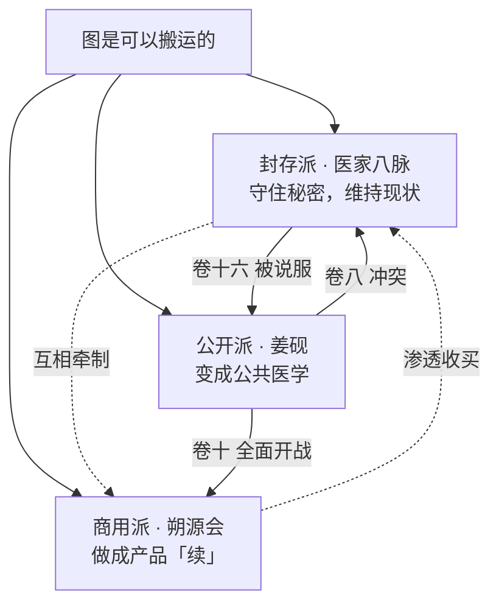

# 14｜势力体系

---

## 一、全书政治结构：三条路线之争

全书所有冲突，最终都可以还原成**同一个问题的三种答案**：

> **"图是可以搬运的"这件事，应该怎么办？**

| 路线 | 主张 | 代表 | 本质 |
|---|---|---|---|
| **封存派** | 谁都别碰，烂在肚子里，八百年来一直如此 | **医家八脉**（阮秋声为最坚定者） | 用垄断维持秩序。稳定，但把所有受害者当代价 |
| **商用派** | 有需求就有市场，做成产品，只服务付得起的人 | **朔源会**（闻涯、虞让） | 用效率吞噬人。高效，且合法性伪装完美 |
| **公开派** | 变成能被验证、被教学、被监管的公共医学 | **姜砚**（+ 苏梨的遗志、裴雾的证据、顾晚舟的司法、温栖迟的临床） | 混乱、危险、会杀死很多人——**但这是唯一一条不需要有人被牺牲的路** |

> **写手须知**：本书没有"正义打败邪恶"，只有"第三条路线打赢了前两条"。
> 因此**八脉不是反派**，他们是"错的好人"。**这是本书立意的核心，不得写崩。**

---

## 二、势力总表

### 表层势力

| 势力 | 性质 | 掌控者 | 核心资源 | 地盘 | 与男主关系 | 出场卷 | 结局 |
|---|---|---|---|---|---|---|---|
| **江城医科大学** | 高校 | 校方/学阀 | 学籍、实验室、法医系、档案 | 江城 | 保护壳 → 阵地 | 卷一 | 终局成为公开化的第一个教学点 |
| **附一（附属第一医院）** | 三甲 | 院长/周致平/贺庭章/阮秋声 | 手术权限、病历系统、会诊制度、**八年前的记录** | 江城 | 敌区 → 主场 | 卷一 | 温栖迟主持的科室成为第一个试点 |
| **江城四姓 · 温氏** | 豪门 | 温亭序 | 地产、政商网络 | 一省 | 敌 → 中立 → 盟（因温栖迟） | 卷四 | 分裂，温栖迟系胜出 |
| **江城四姓 · 岑氏** | 豪门 | 岑立开 → 岑昭昭 | 私立高端医疗集团 | 一省 | 敌 → 盟 | 卷二 | 岑昭昭重整，成为最大资金方 |
| **江城四姓 · 周氏** | 医界世家 | 周致平 → 周慕远 | 附一的行政权 | 江城 | 敌 → 盟 | 卷一 | 周致平入狱，周慕远重建 |
| **江城四姓 · 殷氏** | 豪门（**兼八脉之一**） | 殷九 | 骨科医院、运动康复、"古武"打手 | 一省 | 敌 | 卷四 | 卷十三被清算 |
| **沈氏药业** | 上市药企 | 沈知微 | 生产线、临床试验资质、渠道 | 全国 | 交易 → 背叛 → 盟 | 卷四 | 公开化的产业化执行方 |
| **祝家药房**（37 家连锁） | 民营流通 | 祝棠家 | 药材流向数据、物流网络 | 江城 | 盟 | 卷一 | 成为公开化的分发末端 |
| **专案组** | 司法 | 顾晚舟 | 侦查权、强制力、跨省协作 | 全国 | 敌 → 盟 | 卷五 | 把里层世界纳入司法 |

### 里层势力

| 势力 | 性质 | 掌控者 | 核心资源 | 地盘 | 与男主关系 | 出场卷 | 结局 |
|---|---|---|---|---|---|---|---|
| **姜脉** | 八脉之一（本家） | 姜砚（第十四代持图人） | **《人身舆图》全部记录、图引、祠堂** | 皖南祠堂 + 屺和堂 | 本家 | 卷一 | 记录全部公开，姜脉作为"家族垄断"终结 |
| **医家八脉**（姜/柏/阮/闻/殷/邵/尉/敖） | 学派联盟 | 无统一领袖，八席共议 | 八百年知识垄断 + 现代医疗关键岗位 | 全国 | 对立（封存 vs 公开） | 卷七 | 卷十六解散重组为公开学会 |
| **渡口** | 地下黑市 | 老鸦 | 黑市诊疗、器官协调、"处理"改坏的人 | 跨省水运网络 | 敌 → 被瓦解 | 卷五 | 卷七被端，老鸦死 |
| **朔源会** | 跨国隐藏组织 | 闻涯（执笔） | 医院、药企、保险、殡葬、海关的渗透网；客户名单；三十年实验数据 | 跨国 | 终极敌人之一 | 卷六（暗）/卷十（明） | 卷十五曝光崩解，虞让携部分名单在逃 |
| **老先生** | 个人 | 姜漱 | 三百年的时间、七次完整换图、对全部八脉的了解 | 无形 | 最终敌人 | 卷十二/卷十五 | 见终局 |

---

## 三、势力之间的具体利益连线（写手查证用）

| 连线 | 内容 | 揭示卷 |
|---|---|---|
| 附一 ← 朔源会 | 贺庭章的女儿肾源由朔源会提供，换他八年前的配合 | 卷六 |
| 温氏 ← 朔源会 | 二十年前温母被取图，换温氏在一次土地竞标中胜出 | 卷九 |
| 岑氏 ← 朔源会 | 岑立开是"续"的客户与中间人，掌握部分客户名单 | 卷八 |
| 殷氏 ↔ 八脉 | 殷氏既是豪门也是殷脉，"古武打手"就是被改图的运动员 | 卷四暗示 / 卷七明说 |
| 渡口 ← 八脉·柏脉 | 柏脉借渡口做不能上台面的人体试药 | 卷五 |
| 渡口 ← 朔源会 | 渡口负责处理"失败品"，是朔源会的下游 | 卷七 |
| 沈氏药业 ← 柏脉 | 柏敬亭以首席科学家身份借用沈氏的生产线 | 卷五 |
| 专案组 ↔ 姜怀山 | 顾晚舟的师父与姜怀山同月死亡，查的是同一批案子 | 卷六 |
| 八脉 ↔ 朔源会 | **互相知道对方存在，互相牵制，谁也不敢先动手**。朔源会已收买敖脉与邵脉 | 卷十一 |
| 朔源会 ← 姜漱 | 朔源会本质是姜漱为自己找容器而建的组织，闻涯只是执行人 | 卷十五 |

---

## 四、男主自己的势力成长线

> 大男主必须有自己的班底。姜砚的班底不是打手，是**一套完整的"能把秘密变成公共知识"的基础设施**。

| 阶段 | 卷 | 他手里有什么 |
|---|---|---|
| 一无所有 | 卷一 | 叔公的药铺、两个室友、一张学生证 |
| 有了嘴 | 卷二～卷三 | 病历权限、宁小雀的数据能力、裴雾的病理证据 |
| 有了钱 | 卷四～卷五 | 吴茂的公司、沈氏的生产线与临床资质 |
| 有了人 | 卷六～卷七 | 祝棠的流通网、孟舒澜的院内通道、顾晚舟的司法接口 |
| 有了名分 | 卷八～卷十一 | 第十四代持图人身份；北市药会后八脉必须承认他的席位 |
| 有了知识 | 卷十二～卷十四 | 姜家祠堂八百年记录、图引里的历代脉案、母亲的药理验证手稿 |
| 有了规则 | 卷十五～卷十六 | 听证会、监管框架、可验证的论文、第一批持证的"图医" |

**关键设计**：他的势力**每一层都对应一种"公开化"所必需的要件**——
数据（宁小雀）、证据（裴雾）、临床（温栖迟）、产业（沈知微 + 吴茂）、司法（顾晚舟）、资本（岑昭昭）、渠道（祝棠）、人证（孟舒澜）、学界（尉三省、阮秋声）、记录（姜芥）。

> 这不是"收集后宫/小弟"，这是**在搭建一个能让秘密变成公共知识的机器**。
> 每个角色的加入都必须对应机器上的一个零件——**这就是本书杜绝"工具人"的结构性方法**。
