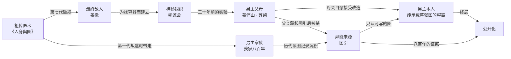

# 17 / 21 / 22｜商业节奏 · 长期伏笔表 · 爽点系统

---

# 21｜长期伏笔表（32 条）

> **铁律**：本表每一条都有明确的**埋点章号**与**揭晓卷号**。写手每写完一卷，必须回查本表，确认本卷该收的全部收掉。
> **不得**出现"后期揭晓""以后再说"这类模糊标注。
> **不得**为了反转而反转——每一条揭晓都必须让前面的描写重新变得合理，而不是推翻前面的描写。

## A. 小伏笔（10 条 · 1–3 卷内回收 · 作用是训练读者"这本书的细节都算数"）

| # | 伏笔内容 | 埋点 | 揭晓 | 揭晓后的意义 |
|---|---|---|---|---|
| 01 | 旧行李箱里有一只包着布的钢针盒 | 卷一 · 001 | 卷一 · 041 / 卷三 · 189 | 他不是普通学生；针是他最不敢用的东西 |
| 02 | 他从不喝别人递过来的水 | 卷一 · 人设 | 卷五 · 332 | 姜家的老规矩，因为他父亲当年就是这么栽的 |
| 03 | 他刻意避开体检室门口的监控 | 卷一 · 003 | 卷二 · 122 | 有人事后调过监控找他 |
| 04 | 温栖迟把那张纸条夹进本子 | 卷一 · 007 | 卷三 · 197 | 她拿出记了两个月的本子当面对质 |
| 05 | 祝棠左肩三个月内脱过一次臼 | 卷一 · 011 | 卷四 · 250 | 她提重物复发，他再次点破——她开始留意"他怎么什么都知道" |
| 06 | 教授把无名尸的事记在备课本上 | 卷一 · 010 | 卷一 · 014 → 022 | 这条信息一路传到贺庭章耳朵里 |
| 07 | 入学体检手部稳定度满分 | 卷一 · 014 | 卷一 · 022 / 卷四 · 286 | 全书第一个"他会施针"的硬证据 |
| 08 | 岑昭昭三天后偷偷去做肝功能 | 卷一 · 019 | 卷二 · 098 / 卷四 · 264 | 她一直在照他说的吃药——她的转向早有伏笔 |
| 09 | 他顺手给档案管理员老人开了贴膏药 | 卷一 · 026 | 卷一 · 037 | 老人替他打了一次掩护。**善意是有回报的**，这是本书的小规则 |
| 10 | 旧楼保安穿的是新鞋、旧工服 | 卷一 · 065 | 卷三 · 159 | 那是手术室外走廊的防滑鞋——他不是保安 |

## B. 中伏笔（12 条 · 跨 4–8 卷 · 作用是把校园线接进都市线与里层线）

| # | 伏笔内容 | 埋点 | 揭晓 | 关联主线 |
|---|---|---|---|---|
| 11 | 陆停的身体"不是练出来的" | 卷一 · 004 | 卷七 · 459 | 殷脉子弟 → **异能＝病** |
| 12 | 吴茂家开殡葬用品店 | 卷一 · 004 | 卷七 · 467 | 通往尉脉与"空图"死者 |
| 13 | 孟舒澜在名册上看到"姜砚"怔住 | 卷一 · 034 | 卷六 · 431 | **父亲之死** |
| 14 | 封存日期是第三天；账本上第三天的大额支出 | 卷一 · 030 / 044 | 卷六 · 437 | 那三天里，姜怀山在保人 |
| 15 | 姜屺撒谎时右手按着药柜最上面一格 | 卷一 · 039 / 045 | 卷九 · 625 | 里面是姜家旁支的脉案 |
| 16 | 姜家规矩的"第四条"被跳过 | 卷一 · 040 | 卷八 · 550 | 第四条＝**不换图** |
| 17 | "很多人会认得姜家的方子" | 卷一 · 043 | 卷四 · 286 | 阮秋声认出他的针法 → 八脉存在 |
| 18 | 老太太："那个姜大夫，后来也没出来" | 卷一 · 054 | 卷三 · 166 | 父亲死在旧楼里，不是死在手术室 |
| 19 | 周慕远的论文题目与"术后不明原因衰竭"有关 | 卷二 · 081 | 卷六 · 399 | **空图**现象的医学侧入口 |
| 20 | 参与人员名单上被划掉的麻醉师 | 卷一 · 027 / 卷二 · 083 | 卷二 · 136 → 卷十 · 737 | 查无此人 → 他是朔源会的人 |
| 21 | 赌局出题人不是学生 | 卷二 · 092 / 097 | 卷四 · 257 | 岑立开私立医疗集团的"医疗顾问" |
| 22 | 姜砚"复读两年"那段档案是空白的 | 卷二 · 094 | 卷七 · 525 → 卷十四 · 1014 | **十七岁那一年**——他自己撕掉的笔记本 |

## C. 大伏笔（8 条 · 跨 8 卷以上 · 全书骨架）

| # | 伏笔内容 | 埋点 | 揭晓 | 承担的主线 |
|---|---|---|---|---|
| 23 | 附一旧楼三楼那扇窗 / 停用手术室的门牌号 | 卷一 · 005 / 069 / 075 | 卷三 · 171 | **图引就在那扇门下面三层** |
| 24 | 一面墙的名字，最后一个编号 1183 | 卷三 · 175–181 | 卷六 · 444 | **病人名单 1200 行** |
| 25 | 一个还活着、但图上一片空白的人 | 卷一 · 068 | 卷六 · 399（命名）→ 卷十 · 731（原理） | **空图 = 被取图的人** |
| 26 | 虞让身上没有任何旧伤 | 卷六 · 424 | 卷十 · 729 | 她的图被整个换过——她自己也是产品 |
| 27 | 姜怀山术前自己改了用药 | 卷六 · 436 | 卷十四 · 1000 | **他救过敌人**（虞让的前任"承笔"） |
| 28 | 母亲在名单第 907 位 | 卷六 · 450 | 卷十二 · 887（907 床）→ 卷十四 · 1007 | **她是自愿的** |
| 29 | 施针手法上"同一只手"的特征 | 卷七 · 503 / 卷八 · 571 | 卷十三 · 969 → 卷十五 · 1051 | **姜漱**——他和姜砚同源 |
| 30 | 客户名单最上面一行始终是空的 | 卷八 · 563 / 卷十 · 741 | 卷十五 · 1089 | 那一行是**老先生** |

## D. 终极伏笔（4 条 · 全书收束点 · 决定结局的成立与否）

| # | 伏笔内容 | 埋点 | 揭晓 | 为什么它是终极的 |
|---|---|---|---|---|
| 31 | **母亲的脸**（第 0 次抵押，前史） | 卷一起，全书反复触碰 | 卷十六 · 1200（最后一页） | 全书情感的锚。他为救母亲付出的第一笔代价，最后一笔才赎回 |
| 32 | **祖训"不换图"后面被磨掉的半句** | 卷八 · 550（跳过）/ 卷十四 · 992（发现被磨） | 卷十四 · 992 | 原文是"**不换图……直至可公之于众**"。**姜家守了八百年，守错了方向。** 这是全书主题句 |
| 33 | **图引里存着历代持图人读过的每一张图** | 卷三 · 171（获得）/ 卷十三 · 909（发现） | 卷十六 · 1157 | 它不只是能力，**它是一份跨越八百年的证据**——终局的真正武器 |
| 34 | **他把读图结论"翻译"成医学语言的习惯** | 卷一 · 050（第一次做） | 卷十六 · 1157 | 他从第 50 章就在做公开化的事，只是自己不知道。**这是全书最漂亮的一次长线回收** |

> 表内共 34 条（超出要求的 30 条，留 4 条冗余以防写作过程中折损）。

## E. 六大伏笔链的关联结构

> 要求是"前期看似无关 → 中期逐渐关联 → 后期全部收束"。以下是六条线**如何咬合**：

**咬合逻辑（写手必须理解，否则会写崩）**：

1. **医术 → 敌人**：姜漱不是外来的反派，他是这门医术自己长出来的果。**没有《人身舆图》，就没有姜漱。**
2. **敌人 → 组织**：朔源会不是一个独立的黑帮，它是姜漱为自己找容器而搭建的基础设施。**打掉朔源会不等于打掉姜漱。**
3. **组织 → 父母**：三十年前的实验里，苏梨是唯一一个主动配合的人——因为她想造一个能终结这一切的人。**姜怀山不知道，或者知道得太晚。**
4. **父母 → 男主**：所以男主的存在本身，既是敌人的作品，也是母亲的反击。**这就是卷十反转的力量来源：同一件事，两种解释，都是真的。**
5. **家族 → 异能**：图引是姜家八百年读图的沉积物，它同时是**能力**和**证据**。这一点决定了终局不是打赢，而是公开。
6. **异能 → 男主**：图引只认"可写的图"，而可写的图只来自被改造过的胎儿——**能力与身世是同一件事**。他越强，越证明他是个产品。

---

# 22｜爽点系统（13 类 · 每类均给不重复变体）

> **反重复总则**：绝不允许连续两次使用同一类爽点，且同一类爽点的**手段**必须每次不同。
> 每一个爽点必须回答三个问题：**谁在看？他为什么必须出手？他付出了什么？**

| # | 爽点类型 | 核心快感 | 本书的不重复变体（按出现顺序） |
|---|---|---|---|
| 1 | **打脸爽** | 认知反转 | ① 课堂式：不反驳只补充（010）② 反向点破：对方羞辱他，他给出一个诊断（019）③ **被打脸的打脸**：他对了却被处分（021）④ 克制型：等对方自己发现才开口（088）⑤ 揭穿造假：指出病历是伪造的（097）⑥ 借他人之口（407）⑦ 不自证，让对手内讧（542）⑧ 当众亮身份（790） |
| 2 | **医术爽** | 专业碾压 | ① 一句话点破漏诊（003）② 从尸体地层读出生前经历（010）③ 纯药方治好慢病（041）④ 算准死亡时间让家属赶得及（054）⑤ 第一次改图（189）⑥ 废掉右手后用药代针（376）⑦ 读尸体的图破案（503）⑧ 全国专家组集体误判他一人正解（407） |
| 3 | **财富爽** | 阶层跃迁 | ① 拒绝三千万只要临床资质（242）② 用信息换资源而不是换钱（234）③ 吴茂注册公司完成第一次合法变现（287）④ 药方产品化，全书最大一笔（806）⑤ **终局他不持有财富，他持有标准**（1172） |
| 4 | **身份爽** | 隐藏身份曝光 | ① "我姓姜"（150）② 阮秋声说出"姜怀山"（294）③ 被八脉承认持图人席位（592）④ **北市药会当众亮身份（790，全书最大值）** |
| 5 | **异能爽** | 超常能力 | ① 获得图引，世界叠上一层（171）② "注"：调阅八百张图做比对（339 埋 / 759 兑现）③ "写"：读尸体（498）④ "溯"：读一片地、还原三十年（834）⑤ **"观"：读制度（1097）** |
| 6 | **智商爽** | 信息碾压 | ① 用处分换档案室通行（025）② 读关节炎算出管理员作息（026）③ 精准控分拿第九名（061）④ 布局让主治自己发现错误（085）⑤ 三处矛盾拆穿伪造病历（097）⑥ 不自证让七脉内讧（542）⑦ **找出姜漱逻辑的前提漏洞（1104）** |
| 7 | **救人爽** | 生命被挽回 | ① 纸条救人不留名（006）② 三人注视下被迫全力出手（071）③ 主动脉夹层的时间赛跑（088）④ 从合法机构里抢人（512）⑤ **救一个与主线毫无关系的陌生人（872）** |
| 8 | **美女认可爽** | 被高质量女性认可 | ① 温栖迟"我记得你"（073）② 裴雾第一次开口说人话（407）③ 岑昭昭"你到底是谁"（271）④ 谢清盏"你是第一个把我当病人的人"（317）⑤ **温栖迟在八脉面前公开站队（781）** |
| 9 | **权贵震惊爽** | 高位者失态 | ① 贺庭章的笔停了一下（022）② 温亭序"有些账是二十年前记的"（241）③ 沈知微"查他，查到底"（249）④ 阮秋声闭眼说"糊涂"（798）⑤ **敖脉当家在台上改口"记不清了"（767）** |
| 10 | **敌人震撼爽** | 反派的世界观崩塌 | ① 周慕远发现他说对了档案里没写的部分（013）② 出题人脸色变了（097）③ 老鸦"名单不在我这"（353）④ 虞让第一次露出计划外的表情（1082）⑤ **姜漱第一次沉默（1104）** |
| 11 | **扮猪吃虎爽** | 长期压抑的释放 | 见 `03-男主档案.md` 的 12 类模板，逐层升级不重样 |
| 12 | **越级反杀爽** | 以弱胜强 | ① 被按在墙上靠一句诊断脱身（317）② 救黑市老大想杀的人逼他反求（347）③ **不打，倒计时（475）**④ 最弱状态下撬开最硬的东西（376–450 整卷）⑤ 用规则清算殷氏（932） |
| 13 | **代价爽**（本书独有） | 心疼与敬重 | 九次抵押，每一次的"失去"都被身边人发现：味觉（250 祝棠发现）、右手（375）、十七岁（525）、痛觉（662）、听力（798 当众）、嗅觉（872）、父亲的记忆（1037）。**这是本书区别于所有同类作品的爽点类型** |

## 爽点分布铁律

| 规则 | 内容 |
|---|---|
| **不重复** | 同类爽点两次出现之间，至少间隔 15 章，且手段必须不同 |
| **有代价** | 第 3 层反派之后，**任何一次爽点都必须附带成本**（暴露、树敌、抵押、身体损伤） |
| **有观众** | 每次爽点必须明确"谁在看"，且观众层级随卷次升级：同学 → 医生 → 豪门 → 地下 → 八脉 → 组织 → 世界 |
| **反爽点配额** | 每卷至少 2 处"他救不了 / 他没资格 / 他被排挤"，用来给爽点定价 |
| **禁止** | ❌ 众人嘲笑 → 男主出手 → 众人震惊（这个三段式全书最多用 3 次，且必须在前 30 章内用完） |

---

# 17｜商业节奏设计

## 密度基准（按书旗男频阅读习惯）

| 层级 | 频率 | 形式 |
|---|---|---|
| **小爽点** | 每 1–3 章 | 一句话点破、一次看穿、一次算准、一次反打。**不需要围观群众，不需要震惊**——一个细节被证实即可 |
| **小高潮** | 每 10–20 章 | 一个剧情单元的结算：拿到某样东西、赢下一场对抗、揭开一个疑点 |
| **中高潮** | 每 30–50 章 | 一次身份/能力/势力的层级变化，或一次重要人物关系的定性 |
| **大高潮** | 每 100 章左右 | 卷末级别：重大反转、重大代价、世界层级跃迁 |

## 十六卷的节奏曲线（**刻意不机械均匀**）

| 卷 | 爽点密度 | 说明 |
|---|---|---|
| 一 | **高** | 开局必须密。前 30 章是生死线 |
| 二 | 高 | 维持密度，建立"每卷都有得看"的预期 |
| 三 | 中高 | 图引 + 首次换图，靠单点高强度而非密度 |
| 四 | **高** | 财富爽 + 豪门爽 + 专家背书，全书最"痛快"的一卷 |
| 五 | 中 | 无力感为主，为卷六蓄力 |
| 六 | 中高 | **第一个大转折卷**。能量集中在卷末名单揭晓 |
| 七 | 高 | 世界观亮牌 + 战斗方式定型，爽点回升 |
| 八 | 中 | 政治博弈卷，智商爽为主，动作爽为辅 |
| 九 | **低** | **全书最黑暗**。刻意压低爽点，把能量存进卷十 |
| 十 | **低 → 转向** | 低谷期已压缩到 45 章（676–734）；决断点前移到**第 735 章**，卷末 15 章是"决断后的第一次反击"。见 `14-终局与总编自检.md` 问题 1 |
| 十一 | **最高** | **全书爽点顶点。** 前十卷积累的憋屈一次放完 |
| 十二 | 中高 | 智商爽顶点（读地层）+ 情感冲击顶点（母亲） |
| 十三 | 中高 | 治愈爽（赎回）+ 秩序爽（清算） |
| 十四 | 高 | 信息海啸 + 最痛的代价 |
| 十五 | 中高 | 纯逻辑对决，爽点形态转为思辨 |
| 十六 | **高** | 三十章密集收束，所有伏笔回收的信息快感 |

> **关键判断**：卷九、卷十的低密度是**故意的**，但这是**全书最危险的地方**——原设计等于连续 150 章情绪低谷，足以掉掉付费最稳的中段读者。
> **保护措施（三条强制执行，见 `14-终局与总编自检.md` 问题 1）**：
> ① **卷十低谷期压缩到 45 章**，决断点前移到第 735 章，卷末 15 章转为反击；
> ② **两卷各加一条与主线情绪脱钩的高爽点副线**——卷九是吴茂的商业线，卷十是宁小雀的技术线，作用是证明"男主的班底自己长起来了"；
> ③ **每 5 章必须给一个"小确幸"**（一次成功的救治 / 一个战友的回归 / 一次情感确认），且这两卷的章末钩子密度提到全书最高，用悬念代替爽点撑住追读。

## 每卷必须回答的三问

已在 `08-总卷纲.md` 逐卷给出。写手每开一卷前，先读那三行。
